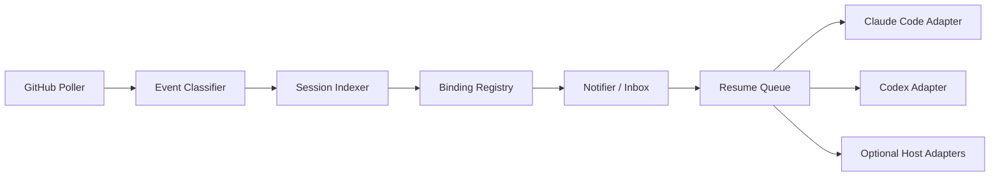

# PR Session Watcher Design

Date: 2026-05-11
Status: Approved for implementation planning

## Summary

Build a local-first PR session watcher that helps developers continue Claude Code or Codex work when a GitHub pull request changes. The watcher polls GitHub from the user's machine, detects actionable PR updates, maps those updates to relevant Claude Code or Codex sessions, asks the user for confirmation, and then resumes or queues work in the selected agent session.

The core product is not Conductor-specific. Conductor, Codex App, tmux, and terminal workflows are hosts or adapters around the same underlying Claude Code and Codex session model.

## Problem

Developers often work on a PR in an agent session, leave review comments in another PR, or address feedback on their own PR. When the PR later changes, they currently have to notice the update through GitHub, email, Slack, or a host UI, then manually find the right session and continue the work.

The missing layer is a reliable local tool that knows:

- Which PRs matter to the user.
- Which Claude Code or Codex sessions are associated with those PRs.
- Which PR events are worth interrupting the user about.
- How to resume or queue follow-up work without forcing a specific host app.

## Goals

- Detect actionable PR updates through local GitHub polling.
- Support both PR author and PR reviewer workflows.
- Work for teammates, not only one user's personal `/review-pr` skill.
- Center the implementation on Claude Code and Codex session discovery/resume surfaces.
- Treat Conductor as an optional host adapter, not a required foundation.
- Ask the user to confirm the first PR/session binding.
- Allow explicit user binding from an active session.
- Resume approved work immediately when the target session is idle.
- Queue approved work when the target session is busy.
- Preserve events in a local inbox when confidence is low or delivery fails.

## Non-Goals

- No GitHub App or shared webhook server in the MVP.
- No Slack integration in the MVP.
- No dependency on Conductor internals for the core workflow.
- No automatic agent resume before the user confirms an event or binding.
- No attempt to handle every GitHub PR event in the first version.
- No replacement for existing PR review skills or commands.

## Product Shape

The MVP is a local CLI plus daemon named `pr-watch`.

The daemon polls GitHub and updates local state. The CLI lets users inspect the inbox, approve delivery, bind PRs to sessions, configure policy, and run diagnostics.

Example commands:

```bash
pr-watch daemon
pr-watch inbox
pr-watch bind #1049 --role reviewer
pr-watch bind https://github.com/org/repo/pull/1049
pr-watch approve <event-id>
pr-watch config set busy_policy run_if_idle_queue_if_busy
pr-watch doctor
```

The implementation target is a Python 3.11+ CLI package under this repository, using standard libraries where practical for subprocess calls, file scanning, and SQLite state. This fits the repository's current shape, which already contains Python utility scripts and does not have a package-managed Node application.

## Architecture



### GitHub Poller

The poller uses the user's local GitHub authentication, preferably through `gh`. It discovers repositories from configured watch roots and explicit bindings, then polls open PRs relevant to the user.

Relevant PRs include:

- PRs authored by the user.
- PRs where the user is a requested reviewer.
- PRs where the user has submitted a review.
- PRs where the user has left review comments or issue comments.
- PRs explicitly bound by the user.

The poller records cursors per repository and PR so repeated runs dedupe events.

### Event Classifier

The classifier turns raw GitHub changes into actionable events. It assigns:

- `role`: `author`, `reviewer`, `requested_reviewer`, or `commenter`.
- `event_type`: normalized event kind.
- `actionability`: whether the event should notify by default.
- `summary`: concise text suitable for a notification or resume prompt.
- `dedupe_key`: stable key to avoid repeated notifications.

Initial MVP event rules are intentionally narrow.

Author role notifications:

- Human review or comment.
- Requested changes.
- Failed CI/check run.
- Merge conflict.

Reviewer role notifications:

- Author pushed commits after the user's review.
- Author replied to the user's comment.
- Review thread resolved or reopened.

Muted by default:

- The user's own comments.
- Label-only edits.
- Duplicate check updates.
- Bot noise that does not imply user action.
- Events already summarized in the same digest window.

### Session Indexer

The session indexer scans Claude Code and Codex local session metadata without requiring a specific host.

Claude Code signals:

- `~/.claude/projects/**.jsonl` session logs.
- Session IDs from `--session-id`.
- Resume surface from `--resume`.
- PR-aware surface from `--from-pr`.
- CWD, branch names, PR URLs, PR numbers, and session titles found in logs.

Codex signals:

- `~/.codex/session_index.jsonl`.
- `~/.codex/archived_sessions/*.jsonl`.
- Resume surface from `codex resume [SESSION_ID] [PROMPT]`.
- CWD, branch names, PR URLs, PR numbers, and session titles found in logs.

Optional host signals:

- Conductor workspace/session data, when available.
- Terminal/tmux metadata, when available.
- Codex App metadata, when available.

Host data can improve confidence but must not be required for the core workflow.

### Binding Registry

The binding registry stores confirmed and candidate PR/session relationships.

Suggested fields:

- `binding_id`
- `repo_owner`
- `repo_name`
- `pr_number`
- `pr_url`
- `role`
- `agent`: `claude` or `codex`
- `session_id`
- `cwd`
- `branch`
- `host`: optional, such as `conductor`, `terminal`, or `codex_app`
- `confidence`
- `confirmed`
- `confirmation_source`: `user_confirmed`, `explicit_bind`, or `inferred_candidate`
- `created_at`
- `updated_at`
- `last_event_at`

The first inferred binding is not treated as confirmed. The user must approve it. Once approved, future events for the same PR/session pair are high confidence.

Users can also create a confirmed binding explicitly:

```bash
pr-watch bind #1049 --role reviewer
pr-watch bind https://github.com/org/repo/pull/1049 --role author
```

### Binding Confidence

The binder should only propose session wake-ups it can explain.

High-confidence signals:

- User-confirmed binding.
- Explicit `pr-watch bind`.
- Session text contains the exact PR URL or PR number and repo matches.
- Current branch maps to the open PR head branch and CWD matches the repo.
- Claude Code `--from-pr` metadata points to the PR.

Medium-confidence signals:

- Repo/CWD matches.
- Branch resembles the PR head branch.
- Session title contains PR/review language.
- Recent terminal or session activity mentions `gh pr`.
- The user recently reviewed or commented on the PR.

Low-confidence signals:

- Only the repo matches.
- Only GitHub participation is known.
- Session metadata is stale or ambiguous.

Default behavior:

- High confidence: offer resume for the named session.
- Medium confidence: ask the user to choose from candidates.
- Low confidence: store in inbox only.

Every proposed wake-up must show its evidence, such as repo, branch, role, session title, last relevant activity, and GitHub participation.

## Delivery Policy

The default delivery model is confirmation-first.

1. The watcher detects an actionable event.
2. The binder proposes a session or stores an inbox item.
3. The user approves delivery.
4. If the target session is idle, the resume adapter runs immediately.
5. If the target session is busy, the event is queued by default.
6. If delivery fails, the event remains in the inbox with an exact recovery command.

Default busy policy:

```text
run_if_idle_queue_if_busy
```

Configurable alternatives:

- `always_queue`
- `notify_only`
- `drop_if_busy`
- `ask_when_busy`

Each resume adapter reports session state as `idle`, `working`, or `unknown`. Unknown state is treated as busy for safety: approved work is queued and the inbox shows the exact command that will run when the user flushes the queue.

## Resume Adapters

### Claude Code Adapter

The Claude adapter should prefer native session surfaces:

- `claude --resume <session-id> "<prompt>"`
- `claude --session-id <session-id> "<prompt>"`
- `claude --from-pr <pr>`, where appropriate

The adapter must handle version differences and report unsupported capabilities through `pr-watch doctor`.

### Codex Adapter

The Codex adapter should prefer:

```bash
codex resume <session-id> "<prompt>"
```

If a session cannot be resumed, the event remains in the inbox with the attempted command and error.

### Prompt Shape

The resume prompt should be concise and action-oriented.

Example:

```text
PR #1049 was updated after your review.

Event: bang9 pushed 3 commits after your latest review.
Role: reviewer
Repo: sendbird/ai-agent-js
Suggested next step: inspect the new commits and decide whether the previous review comments are addressed.

Please summarize what changed and ask before posting any GitHub comment.
```

Author example:

```text
Your PR #1049 has new feedback.

Event: requested changes from bang9 and failed CI check "test".
Role: author
Repo: sendbird/ai-agent-js
Suggested next step: inspect the feedback and CI failure, then propose an action plan before editing.
```

## Inbox and Notification UX

The local inbox is the source of truth for pending events. Notifications are a convenience layer.

Inbox item fields:

- Event summary.
- PR link.
- Role.
- Suggested session.
- Confidence and evidence.
- Available actions: approve, choose session, bind, mute, dismiss.
- Delivery status.

Notifications should be short:

```text
PR #1049 changed after your review.
Suggested session: "Re-review PR 1049" (Claude Code)
Action: approve to resume, or open inbox.
```

The MVP can start with CLI inbox output. Native OS notifications can be added as a delivery channel if straightforward.

## Configuration

Suggested config file:

```text
~/.pr-watch/config.toml
```

Initial settings:

```toml
poll_interval_seconds = 120
busy_policy = "run_if_idle_queue_if_busy"
default_delivery = "confirm_first"

[github]
use_gh_cli = true

[events.author]
enabled = ["human_review", "requested_changes", "ci_failed", "merge_conflict"]

[events.reviewer]
enabled = ["author_push_after_review", "author_reply", "thread_resolved", "thread_reopened"]

[session_discovery]
claude = true
codex = true
conductor_optional = true
```

Repository-specific overrides can be added later.

## State Storage

Suggested state directory:

```text
~/.pr-watch/
```

Suggested files:

- `config.toml`
- `state.sqlite` or `state.json`
- `events.jsonl` for append-only debugging
- `logs/pr-watch.log`

SQLite is preferred once queueing and dedupe become non-trivial. JSON is acceptable for a narrow prototype, but the implementation should avoid ad hoc partial writes.

## Error Handling

GitHub auth failure:

- Mark polling as unhealthy.
- Show `gh auth status` guidance.
- Do not delete existing bindings.

GitHub rate limit:

- Back off polling.
- Preserve cursors.
- Show the next retry time.

Ambiguous binding:

- Do not wake a session.
- Show candidates in inbox.

Session not found:

- Keep the event.
- Mark the binding stale.
- Offer rebinding.

Resume failure:

- Keep the event.
- Store stderr/exit status.
- Show exact retry command.

Busy session:

- Apply configured busy policy.
- Default to queue after user approval.

Duplicate event:

- Suppress using `dedupe_key`.
- Update existing inbox item if the summary window is still active.

## Privacy and Safety

- Store all state locally by default.
- Do not send PR contents to any new third-party service.
- Use the user's existing GitHub authentication.
- Do not auto-post GitHub comments.
- Do not auto-push commits.
- Do not resume an agent before confirmation.
- Redact tokens from logs.
- Make diagnostics safe to share by default.

## Testing Strategy

Unit tests:

- Event classification by role.
- Dedupe key generation.
- Binding confidence scoring.
- First-binding confirmation behavior.
- Explicit binding behavior.
- Busy policy decisions.
- Resume prompt rendering.

Integration tests:

- GitHub API fixture replay.
- Claude session fixture discovery from `.jsonl`.
- Codex session fixture discovery from `session_index.jsonl`.
- Resume adapter dry-run command generation.
- Inbox state transitions.

Manual tests:

- Bind a test PR in `AhyoungRyu/claude-code`.
- Simulate author feedback event.
- Simulate reviewer "author pushed after review" event.
- Approve delivery to idle Claude session.
- Queue delivery while a session is busy.
- Verify fallback when the session ID is stale.

## Rollout Plan

Phase 1: Discovery prototype

- Poll GitHub through `gh`.
- Build event classifier.
- Build local inbox.
- Support explicit `pr-watch bind`.
- Generate resume commands without executing them by default.

Phase 2: MVP complete

- Add Claude and Codex resume adapters.
- Add queue policy.
- Add first-binding confirmation flow.
- Add `doctor`.

Phase 3: Host adapters

- Add optional Conductor discovery hints.
- Add terminal/tmux convenience integrations if useful.
- Add OS notifications.

Phase 4: Team polish

- Add install docs.
- Add config examples.
- Add repository-specific event rules.
- Add safer diagnostics export.

## Acceptance Criteria

- A teammate can install the tool without using the author's personal PR review skills.
- The tool can detect a relevant PR update through local polling.
- The first inferred PR/session binding asks for confirmation.
- An explicit `pr-watch bind` creates a confirmed binding.
- A confirmed binding is used as high-confidence evidence for later updates.
- The user can approve an inbox item to resume work.
- Idle sessions resume immediately after approval.
- Busy sessions queue by default after approval.
- Low-confidence events remain in the inbox without waking an agent.
- Resume failures preserve the event and show a recovery command.
- The MVP does not depend on Conductor internals.
