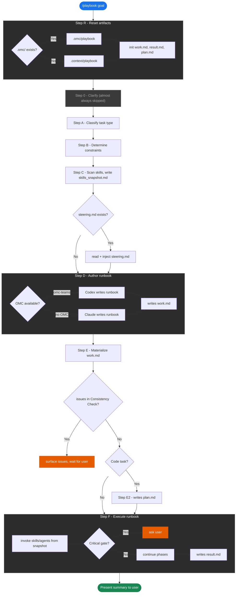

# playbook

Turn any natural-language goal into a structured, executable runbook.

## What it does

1. Classifies your task type (`code-change`, `refactor`, `code-cleanup`, `file-ops`, `research`, `config`, `docs`, `planning`)
2. Snapshots all available Claude Code skills and OMC agents
3. Delegates runbook authoring to Codex with task-appropriate phases and constraints
4. Executes autonomously — stops only on critical gates (irreversible actions, unexpected scope, failing baseline)
5. Writes trace artifacts to `.omc/playbook/` or `.context/playbook/` (work.md, plan.md, result.md)

## Install

```bash
cp -r skills/playbook ~/.claude/skills/
```

## Dependencies

**OMC is optional.** Playbook works in two modes:

| Mode | Runbook authoring | Requirement |
|------|-------------------|-------------|
| With OMC | Delegates to Codex via `oh-my-claudecode:omc-teams` for higher-quality runbooks | [oh-my-claudecode](https://github.com/AhyoungRyu/claude-code) installed |
| Without OMC | Claude authors the runbook directly using the same template | Plain Claude Code, no extras |

During execution, playbook invokes whatever skills are listed in your `skills_snapshot.md` — resolved at runtime from your local `~/.claude/skills/` directory.

## Usage

```
/playbook <your goal>
```

Examples:
```
/playbook fix the type error in UserCard component
/playbook remove all unused imports across the repo
/playbook research how data flows from API to the chart render
/playbook update README to reflect the new monorepo structure
```

## How it works



## Artifacts

All output is written to `.omc/playbook/` (or `.context/playbook/` if `.omc/` doesn't exist):

| File | What's inside |
|------|---------------|
| `work.md` | Full Codex-authored runbook: phases, step-by-step actions, skill mappings, consistency check |
| `plan.md` | Pre-execution plan extracted before any code is touched: files to modify, rationale, test gates *(code tasks only)* |
| `result.md` | Run summary written at completion: changes made, skills invoked, artifacts produced, open TODOs |
| `baseline.md` | Test/build state captured before any changes *(code tasks only, when applicable)* |
| `skills_snapshot.md` | Auto-generated inventory of all available slash commands and OMC agents, used during planning |
| `steering.md` | Persistent project-level constraints you write once and inject into every subsequent run |

### Example: `work.md`

```markdown
# work.md
Run: 2026-03-06T10:42:00+09:00
Task type: code-change

## Baseline
- Tests: 331 passing
- Build: success (68.73 kB)

## Plan
1. Locate `UserCard` component — direct implementation
2. Fix type error on line 42 — oh-my-claudecode:executor
3. Run type check — direct implementation

## Implement
...

## Proof
- pnpm tsc --noEmit ✅
- pnpm test ✅

## Consistency Check
✅ All consistency checks passed.
```

### Example: `result.md`

```markdown
# result.md
Run: 2026-03-06T10:45:00+09:00
Task type: code-change

## Changes / Findings
Fixed type error in UserCard component (src/components/UserCard.tsx:42):
replaced `any` with `User` interface type.

## Skills invoked
- oh-my-claudecode:executor

## Artifacts produced
- .omc/playbook/work.md
- .omc/playbook/plan.md
- .omc/playbook/result.md

## Risks / TODOs
none
```

### Example: `plan.md`

```markdown
# plan.md
Run: 2026-03-06T10:42:30+09:00
Task type: code-change

## Files to modify
- src/components/UserCard.tsx — fix type error on line 42 (replace `any` with `User`)
- src/types/user.ts — verify `User` interface is exported

## Change rationale
The `any` type suppresses TypeScript's type safety. The `User` interface already exists
in `src/types/user.ts` and covers all properties accessed on line 42.

## Skill mapping
- Step 1 (locate component): direct implementation — simple file read
- Step 2 (apply type fix): oh-my-claudecode:executor — targeted code edit
- Step 3 (run type check): direct implementation — shell command

## Test / build gates
- pnpm tsc --noEmit
- pnpm test --run
```

### Example: `skills_snapshot.md`

```markdown
# Skills Snapshot
Generated: 2026-03-06T10:42:10+09:00

## File-based skills (slash commands)

| Command | Description |
|---------|-------------|
| /playbook | Turn any natural-language goal into a structured, executable runbook |
| /senior-frontend | Comprehensive frontend development with React, Next.js, TypeScript, Tailwind |
| /review-pr | Comprehensive PR review using parallel specialist agents |
| /webapp-testing | Browser-based UI testing and verification using Playwright |

## OMC built-in agents

| Agent | Role |
|-------|------|
| oh-my-claudecode:executor | Code implementation, refactoring, feature work |
| oh-my-claudecode:explore | Internal codebase discovery, symbol/file mapping |
| oh-my-claudecode:debugger | Root-cause analysis, regression isolation |
| oh-my-claudecode:verifier | Completion evidence, claim validation, test adequacy |
| oh-my-claudecode:build-fix | Build/toolchain/type error resolution |
| oh-my-claudecode:test-engineer | Test strategy, coverage, flaky-test hardening |
```

### Example: `baseline.md`

```markdown
# baseline.md
Run: 2026-03-06T10:42:05+09:00
Task type: code-change

## Test baseline
pnpm test --run

PASS  src/components/UserCard.test.tsx (12 tests)
PASS  src/hooks/useUser.test.ts (8 tests)
Tests: 331 passed, 0 failed

## Build baseline
pnpm build

dist/index.js   68.73 kB (gzip: 21.4 kB)
Build: success, no errors, no warnings

## Type check baseline
pnpm tsc --noEmit

src/components/UserCard.tsx:42:14 - error TS2345:
  Argument of type 'any' is not assignable to parameter of type 'User'.
1 error
```

### Example: `steering.md`

```markdown
# Steering

- We use Zustand, not Redux
- Never use barrel imports
- All async functions must handle errors explicitly
- pnpm workspace: packages/charts is the library, apps/demo is the showcase
```

Playbook reads `steering.md` automatically on every run and injects it into the Codex prompt as hard constraints.
